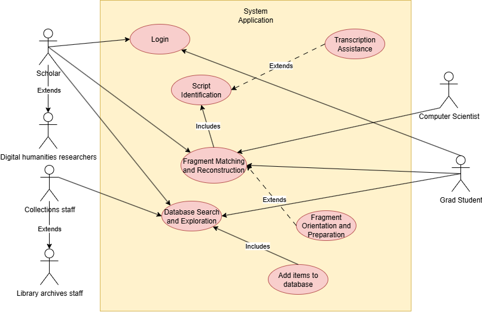

[#g5,reftext=G.5]
=== (G.5) High-level usage scenarios

ifdef::env-draft[]
TIP: _Fundamental usage paths through the system. It presents the main scenarios (use cases) that the system should cover. The scenarios chosen for appearing here, in the Goals book, should only be the **main usage patterns**, without details such as special and erroneous cases; they should be stated in user terms only, independently of the system's structure. Detailed usage scenarios, taking into account system details and special cases, will appear in the System book (<<s4>>)._  <<BM22>>
endif::[]

.High Level use cases diagram

==== System Overview

The system will support scholars of Buddhist textual history by providing tools that automate and accelerate the process of reconstructing fragmented manuscripts. The following main usage scenarios capture the essential ways in which users will interact with the system:

==== Fragment Orientation and Preparation

* A scholar uploads a set of digitized manuscript images.
* The system automatically cleans, crops, and regularizes the orientation of the fragments so that they are ready for analysis.

==== Fragment Matching and Reconstruction

* The scholar requests possible matches for a selected fragment.
* The system scans edges, shapes, and damage patterns, and proposes a ranked set of likely matches.
* The scholar inspects the proposed matches and confirms or rejects them.

==== Script Identification

* The scholar views a fragment of uncertain origin.
* The system automatically identifies the paleographical script (e.g., Sanskrit, Tibetan, Chinese) and displays the classification to the user.

==== Transcription Assistance

* The scholar opens a fragment and requests an initial transcription.
* The system provides a machine-generated transcription of visible characters, which the scholar can review, correct, and annotate.

==== Database Search and Exploration

* The scholar queries the system’s database (e.g., “find all fragments in Gupta script with more than 5 visible lines of text”).
* The system returns results that can be sorted, compared, and linked with other fragments.

==== Login

* The scholar opens the system’s login page.
* The scholar enters their username and password.
* The system verifies the credentials.
* If valid, the system grants access and displays the main dashboard.

