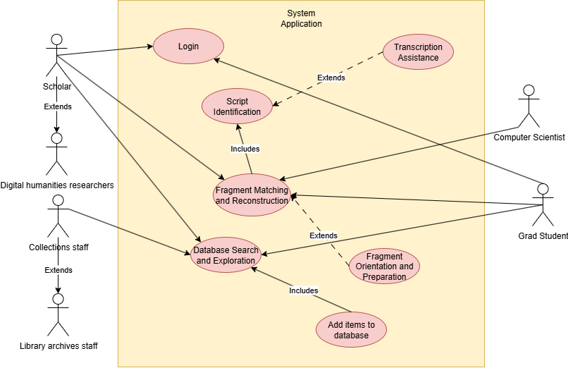

[#g5,reftext=G.5]
=== (G.5) High-level usage scenarios

ifdef::env-draft[]
TIP: _Fundamental usage paths through the system. It presents the main scenarios (use cases) that the system should cover. The scenarios chosen for appearing here, in the Goals book, should only be the **main usage patterns**, without details such as special and erroneous cases; they should be stated in user terms only, independently of the system's structure. Detailed usage scenarios, taking into account system details and special cases, will appear in the System book (<<s4>>)._  <<BM22>>
endif::[]

Figure 1 shows the high-level use case diagram for the system, which you can refer to throughout this section for a clearer understanding.

.High Level use cases diagram

==== System Overview

The system will support scholars of Buddhist textual history by providing tools that automate and accelerate the process of reconstructing fragmented manuscripts. The following main usage scenarios capture the essential ways in which users will interact with the system:

==== Search, Filter, and Place Fragments

* A scholar searches by fragment ID or applies filters (line count, script type, edge flags, circles, custom fields).
* The system returns matching fragments in the sidebar.
* The scholar drags fragments onto the canvas and arranges them.

==== Edge Matching and Reconstruction

* The scholar selects a fragment and requests edge-based candidate matches.
* The system produces candidate matches based on edge descriptors.
* The scholar inspects candidates and arranges fragments on the canvas.

==== Metadata Viewing and Editing

* The scholar opens a fragment’s metadata panel.
* The system displays current metadata and ML-generated values.
* The scholar edits fields (line count, script type, edge flags, circle, scale, custom fields) as needed.

==== Upload New Fragments

* The scholar uploads one or more fragment images.
* The system adds them to the local data store for browsing and processing.

==== Run the ML Pipeline

* The scholar or operator runs the local ML pipeline.
* The system updates segmentation and metadata fields for fragments.

